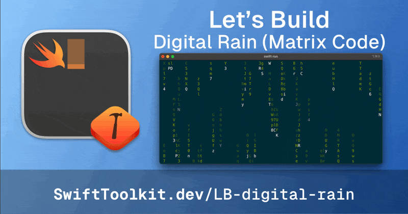

# Digital Rain

A Swift command-line application that creates the iconic "digital rain" effect from The Matrix in your terminal. Watch as cascading green characters fall down your screen, creating a mesmerizing visual effect.

Check the [full post at SwiftToolkit.dev](https://SwiftToolkit.com/posts/lb-digital-rain) to learn more about the implementation.



## Features

The application creates a full-screen effect where:
- Green characters cascade down the screen
- White characters lead each falling line
- Characters dim as they approach the end of their lifespan
- The effect fills your entire terminal window

## Usage

After cloning this repository, `cd` into it, and run the application:

```bash
swift run
```
